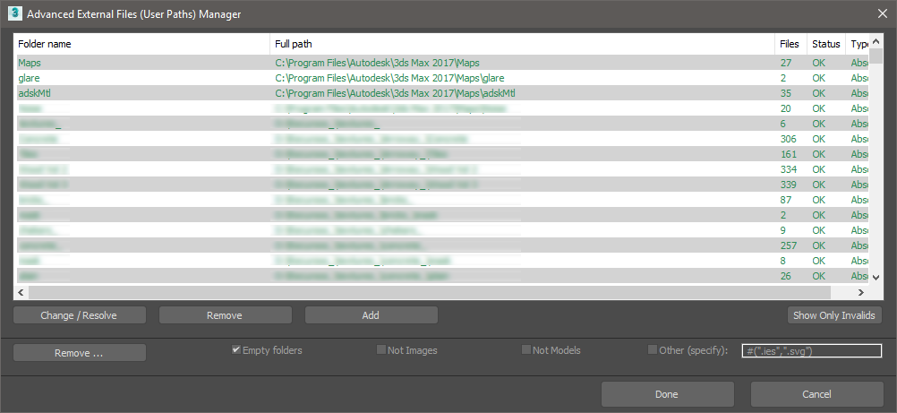
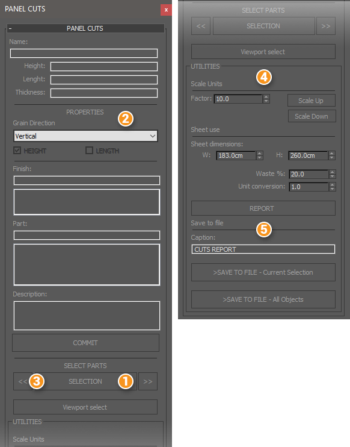
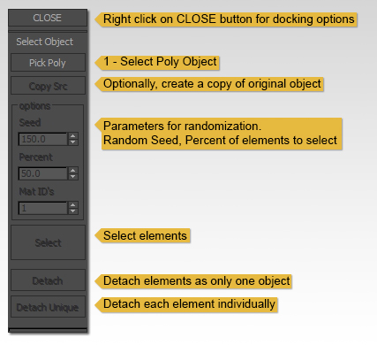

# Free 3ds Max Tools

## MaxScript tools

| File | Name | Description |
| ---- | ---- | ----------- |
| ../Max UI                 |                 | 3Ds Max custom dark UI scheme.
| ./plugins/HAG_Resizer.mse | Resize modifier | Change node XYZ dimensions.
| ./usericons               | UI Icons for some of the scripts | Change node XYZ dimensions.
| Panel_cuts                | Panel cuts             | Tool for creating panel cuts reports. Useful for furniture or cabinets design.
| Adv_path_mngr             | Advanced Paths Manager | Utility for managing user paths (beta)
| Random_detach             | Random Detach          | Random detach **editable poly** elements.
| Random_select             | Random Select          | Random nodes selection.
| Render_tools              | Camera tools           | Compact interface to manage, review, select cameras. It also can add batch render views, change resolution and aspect ratio per camera. Comes with presets for common aspect ratios.
| Vertex_scrambler          | Vertex scrambler       | Random shift vertex positions in a mesh.
| VrayMat_populate          |                        | Populate material editor slots with VRayMtl
| Align_assets              | Align assets           | Rearrange nodes in a row.
| Gamma_adjustment          |                        | Convert Normal Maps gamma
| ViewPortCompositionGuides |                        | Display photographic composition guides overlay in viewport.
| Xref_Replace              | Replace with Xref      | Replace selected node with Xref Record.
| ArchScaler                | Architecture Scale     | Small utility to rescale nodes using an architectural scale factor.
| Mat_Tools | MapLoader   | Load multiple bitmapTextures to the slate material editor
| Mat_Tools | FnameToBMap | Change the names of Bitmap Textures to the name of the loaded files.
| Mat_Tools | Remove_mats | Remove material from selection
| Mat_Tools | SelNoMat    | Filter nodes without material in current selection.
| Mat_Tools | ObjIDbyCAM  | Set objects ID for current camera view
| Mat_Tools | FaceSel     | Select faces with same material ID
| Mat_Tools | RndIDSet    | Set random material IDs for selected faces
| Mat_Tools | QIDSet      | Set material IDs for selected faces
| Audit-materials | Audit Materials | Filter objects by material

## MCG solutions

* **HyperClone**: Advanced cloning tool.
* **ShereClone**: Instance objects on a spherical space or in a convex closed mesh.

---

## Install notes

1. Locate **3ds Max user folder**. Usually at: *C:\Users\USER_NAME\AppData\Local\Autodesk\3dsMax\20XX - 64bit\ENU*
2. Copy **.ms** and **.mse** to *scripts*, *.mcr* files to *usermacros* and Icons (.bmp) to *usericons*
3. Restart Max if opened
4. Add the macro to a toolbar. Found under the category "HAG tools"

---

## Advanced path manager

Listview for managing External files User Paths. Listview for managing External files User Paths.
It has several advantages over the the default Max´s dialog, some are:
More useful UI with colors and font effects to indicate directories status, display only invalid paths, remove empty folders paths and more...

### Reference

* Paths to be deleted : Marked by strikeout text.
* Paths to be added : Showed on bold text.
* Paths modified: Text marked with underline.
* Changes are only applied when pressing "Done".

---

## Panel Cuts

Tool for creating panel cuts reports. Useful for furniture or kitchen cabinets design.

### features

* Material finish, part type, description, grain orientation properties.
* Sheet use report.
* Export a .csv file with Part quantity, dimensions, finish, grain direction, part and description values; Import the file in a spreadsheet or cut optimization software.

### How to use

>*In order to effectively use the tool, you will need a clean, real scale model, composed of individual objects for each piece of the model.*

1. Select the parts (individual objects making a kitchen cabinet, for example) of the model that you want to add the properties that will be used to generate the report. Press the "SELECTION" button to make all the selected objects active in the tool. Alternatively, activate the "Viewport select" toggle button if you want to pick each object alone in the Viewport.

2. Start adding properties. Grain direction will swap the piece height and width, in order to accommodate the cuts to the sheet face texture direction. "Finish" indicates the material color, skin, etc. "Part" can be used as indicative of the piece position/function (i.e. Kitchen Module 1 - Lateral stand). Once you are done, press the "commit" Button. Note: Right-click on "Commit" will apply the properties to the entire  objects collection. Values entered in the textbox will be added to the below listbox. Double click on an item in the listbox to reutilize it.

3. Navigate through the objects in the collection with the previous ("<<") and next (">>") buttons.
    * The tool has a visual feedback, displaying as wireframe the objects in the collection and shading the current active one, also a viewport label shows the selected object dimensions.
    * Right click on prev. or next buttons to commit properties.

4. Utilities.
    * Scale units: objects are measured in current Max's active units system and scale. Use the units factor to convert stored dimensions between units. I.e: If the system scale is configured in centimeters, use a factor of 10.0 and scale up to change the measurements to millimeters.
    * Sheet dimensions: Generate a report of how much sheets (or sheet area) the pieces will require. Account for wastage.

5. Save to file. This is the main functionality of this tool. Export a list of the parts to a .csv file. It can be later imported in a Spreadsheet or cut optimization program.

---

## Random Detach

---

## Random Select

Random node selection. By percent of the selected nodes or "Dot-Gap" pattern.

### Modes

* Percent: Keep a random percentage of the total quantity of nodes in the current selection.
* Step: Performs a skip pattern in the selection.
* Subtract: Same as percent, but inverse: deselect a random percentage within selection.
* Pattern: Not a random mode; Instead it wil unselect nodes following a pattern.

### Values

* Percent: Percentage of nodes quantity to be selected
* Step: Quantity of objects to skip in the selection
* Subtract percent: Percentage of nodes quantity to be un-selected

>Note: The tool will respect the selection pick order.

### Pattern

* Keep: How much objects the pattern will keep
* Quit: Quantity of objects that will be deselected.

>Example:
>Keep: 3; Quit: 2

---
